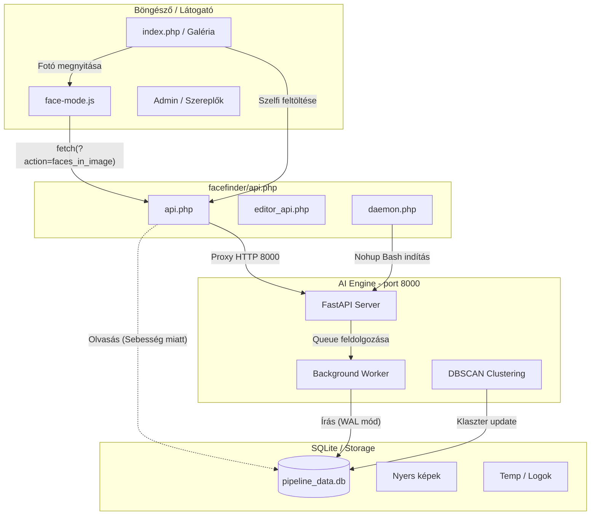

# 🧠 VisionAI Facefinder – Teljes Rendszerdokumentáció és Integrációs Útmutató

> **Verzió:** 2.2.0 | **Utolsó frissítés:** 2026. Május  
> **Környezet:** PHP 8.1+, Python 3.12+, SQLite3, FastAPI

A **VisionAI Facefinder** egy saját fejlesztésű, elosztott architektúrájú (hibrid PHP és Python) arcfelismerő és gépi látás (Machine Vision) motor. Elsődleges célja nagy mennyiségű (akár több százezer) nyers fotó és videóképkocka gyors, automatizált indexelése, az azokon található arcok azonosítása, csoportosítása (klaszterezése) és egy villámgyors szelfi-alapú vizuális keresőmotor biztosítása a végfelhasználók számára.

A rendszer moduláris, ami azt jelenti, hogy a `facefinder` mappa egy önálló, hordozható mikroszolgáltatásként (microservice) viselkedik. Bármely más weboldalba (pl. a 24 órás vetélkedő galériába) könnyedén beépíthető az API végpontok és a biztosított JavaScript könyvtárak segítségével anélkül, hogy a fő weboldal logikáját meg kellene bontani.

Ez a dokumentáció – a kérésnek megfelelően – kiemelkedő részletességgel mutatja be a rendszer minden apró fogaskerekét, hogy külsős fejlesztők, integrátorok, vagy akár te magad hónapok múltán is **zökkenőmentesen ("szopás nélkül")** tudd bővíteni, karbantartani vagy más projektbe átemelni a kódot.

---

## 📋 TARTALOMJEGYZÉK

1. [Telepítés és Rendszerigények](#1-telepítés-és-rendszerigények)
2. [Architektúra és Rendszerterv](#2-architektúra-és-rendszerterv)
3. [Mappa és Fájlstruktúra Részletes Elemzése](#3-mappa-és-fájlstruktúra-részletes-elemzése)
4. [Python AI Backend & Konfiguráció](#4-python-ai-backend--konfiguráció)
5. [Frontend Integrációs Útmutató](#5-frontend-integrációs-útmutató)
6. [API Referencia – Végpontok és JSON Sémák](#6-api-referencia--végpontok-és-json-sémák)
   - [6.1 Keresés (Search)](#61-keresés-search)
   - [6.2 Képi arcok lekérdezése (Faces in Image)](#62-képi-arcok-lekérdezése-faces-in-image)
   - [6.3 Szereplők/Klaszterek lekérése](#63-szereplőkklaszterek-lekérése)
   - [6.4 Szereplőhöz tartozó arcok](#64-szereplőhöz-tartozó-arcok)
   - [6.5 Démon vezérlés](#65-démon-vezérlés)
7. [Adatbázis Architektúra és Indexelés](#7-adatbázis-architektúra-és-indexelés)
8. [Biztonság, Adatvédelem és GDPR](#8-biztonság-adatvédelem-és-gdpr)
9. [Hibakeresés és Karbantartás](#9-hibakeresés-és-karbantartás)
10. [Újítások és Fejlesztési Napló (Changelog)](#10-újítások-és-fejlesztési-napló-changelog)

---

## 1. Telepítés és Rendszerigények

A Facefinder telepítése automatizált bash scripten keresztül történik, amely gondoskodik a megfelelő jogosultságokról és a Python függőségek beszerzéséről.

### 1.1 Rendszerigények
- **Operációs rendszer:** Ubuntu 22.04+ / Debian 11+ (Windows fejlesztői környezet is támogatott).
- **Webszerver:** Apache 2.4+ vagy NGINX, PHP 8.1+ futtatási környezettel (PDO_SQLITE kiterjesztéssel).
- **Python:** Python 3.12+ a szükséges header fájlokkal (`python3-dev`).
- **Hardver:** AI inferenciához ajánlott minimum 8GB RAM. Opcionális: NVIDIA GPU CUDA 12+ támogatással a valós idejű feldolgozáshoz.

### 1.2 Telepítés (`install.sh`)

Minden függőséget a lokális `facefinder/pylib` mappába telepít a rendszer, így elkerülhető a rendszerszintű csomagütközés (Isolation). Lépj be a könyvtárba, majd futtasd a scriptet:

```bash
cd /var/www/vhost/te-oldalad.hu/facefinder
sudo chmod +x install.sh
./install.sh
```

**Mit csinál az install.sh?**
1. Ellenőrzi a Python3 és az SQLite3 CLI meglétét.
2. Létrehozza a `data/`, `temp/`, és `pylib/` mappákat, amennyiben nem léteznek.
3. Beállítja a `chmod 0777` jogosultságokat az adat- és ideiglenes mappákra (mivel a PHP Apache felhasználó és a parancssorból indított Python script eltérő uid-vel futhat).
4. Letölti a pip csomagokat (`fastapi`, `uvicorn`, `onnxruntime`, `decord`, `opencv-python-headless`) egyenesen a `pylib/` mappába a `--target` paraméter használatával.

Ezután a backend készen áll, nincs szükség Dockerre vagy rendszerszintű virtualenv aktiválásra, mert a PHP daemon-indító script explicit módon beinjektálja a `PYTHONPATH`-ba a `pylib` mappát.

---

## 2. Architektúra és Rendszerterv

A VisionAI rendszer mikroszolgáltatás-jellegű. Az aszinkron feladatokat (arc felismerés, vektorok kiszámítása) egy önállóan futó Python Uvicorn daemon végzi, miközben a publikus weblapot (index.php) és a klienseket a villámgyors PHP szolgálja ki, közvetlenül olvasva az SQLite adatbázist.



### 2.1 A Kommunikáció Lényege
1. **Démon Menedzsment:** A PHP (`daemon.php`) ellenőrzi, hogy a 8000-es porton él-e a szolgáltatás. Ha nem, a háttérben elindítja a Pythont. A weboldal sosem fagy le, mert a PHP nem várja meg az AI folyamatok végét.
2. **Közvetlen Adatbázis Hozzáférés:** Bár van Python API, az olyan tömeges olvasásokat, mint pl. a "Kérd le XY klaszter összes 5000 képét" a PHP közvetlenül intézi PDO segítségével. Mivel a Python `PRAGMA journal_mode=WAL;` (Write-Ahead Logging) módban írja az adatbázist, az írás **nem blokkolja** a PHP-s olvasást. Emiatt a galéria betöltése milliszekundumos nagyságrendű marad.
3. **Proxyzás:** Ha valamiért az AI motort kell hívni (pl. keresés futtatása egy feltöltött szelfire), a PHP `api.php` fogadja a POST kérést a webtől, áttölti a képet a `temp/` könyvtárba, és egy belső HTTP kéréssel továbbítja a Pythonnak. A weblap így sosem látja, hogy valójában egy Python daemon dolgozik a háttérben.

---

## 3. Mappa és Fájlstruktúra Részletes Elemzése

Annak érdekében, hogy "szopás nélkül" tudd integrálni a fájlokat, pontosan értened kell, melyik fájl milyen felelősségi körrel rendelkezik.

### 3.1 Gyökérkönyvtár (`facefinder/`)

A vezérlőpult frontend fájljai (ez maga az admin felület).

* **`index.php`**: A fő Dashboard. Autentikációt (jelszó kérést) kezel, ha sikeres a belépés, megjeleníti a főmenüt (Arc Kereső, Klaszterek, Képek, Rendszer).
* **`search.php`**: *[Korábban faces.php volt]* Ez a "Szereplők" nézet. Megjeleníti az eddig azonosított klasztereket. A felhasználó itt tud szelfit bedobni, hogy kiszűrje, egy adott ember mely klaszterekben szerepel. Erősen támaszkodik a `static/js/search.js` kódra.
* **`clusters.php`**: Dedikált admin felület az AI hibáinak javítására. Ha a gép két különböző embert mosott össze, vagy rosszul osztályozott egy arcot, ezen a felületen lehet a képeket áthelyezni másik klaszterbe, törölni őket, vagy összeolvasztani két klasztert.
* **`images.php`**: Nyers galéria nézet. Egyszerű, gyors betöltésű rács, ahol a még feldolgozatlan (vagy már feldolgozott) képeket lehet ömlesztve törölni, ha feleslegesek.
* **`system.php`**: A Python démon és az adatbázis állapota. Innen lehet leállítani/újraindítani a komponenst, követni a live logokat (`fastapi.log`), elindítani a hiányzó indexképek pótlását, és kiexportálni az adatbázist biztonsági mentésként.
* **`api.php`**: **(KRITIKUS FÁJL)** Ez a publikus külvilág (pl. a főoldali galéria) és az AI motor közötti egyetlen engedélyezett átjáró. Ez a fájl nincs jelszóval védve, de Rate Limiting védi! Lásd az 5. fejezetet.
* **`faces_old.php`**: A `search.php` egy régi verziója, technikai adósságként maradt meg, biztonsági mentés. Törölhető.

### 3.2 Backend PHP API-k (`facefinder/api/`)

A vezérlőpult (Dashboard) belső kommunikációjára szolgáló végpontok. Ezek többsége ellenőrzi a Sessiont (`$_SESSION['ai_ok']`).

* **`auth.php`**: A bejelentkezést kezeli, jelszót ellenőriz a `config.php`-ból.
* **`auth_check.php`**: Egy soros helper, ami megszakítja a futást, ha a user nincs bejelentkezve.
* **`config.php`**: A PHP oldali útvonalak, jelszó (`AI_PASSWORD = 'admin123'`), és a FastAPI portjának (8000 vagy Win esetén 8005) beállítása.
* **`daemon.php`**: Felelős a Python backend elindításáért és kilövéséért (`ps aux | grep uvicorn | xargs kill -9`).
* **`db.php`**: Singleton osztály az SQLite adatbázis kapcsolathoz (PDO objektum visszaadása a belső szkripteknek).
* **`editor_api.php`**: A `clusters.php` és `images.php` frontendeket kiszolgáló végpont. Képes tömeges mozgatásra, arcok minőség alapú (`quality_score`) törlésére, és az adatbázis rekordok manipulálására.
* **`gallery.php`**: Ritkán használt helper a nyers képfájlok fizikai mappából történő kilistázásához.
* **`logs.php`**: A `system.php` live-console nézetéhez (Serial Plotter stílusú ablak) olvassa ki a `fastapi.log` utolsó X sorát AJAX-on keresztül.
* **`maintenance.php`**: Karbantartó scriptek (Adatbázis exportálás másolással, WAL napló befésülése (checkpoint)).

### 3.3 Python AI Motor (`facefinder/backend/`)

Ez a modul szíve.

* **`main.py`**: A FastAPI szerver belépési pontja. Regisztrálja a `/api/search`, `/api/queue/scan_images` stb. végpontokat. Inicializálja az Engine-t és a Workert aszinkron loopban (`@app.on_event("startup")`).
* **`config.py`**: A neurális háló beállításai.
  - Tiling méretek, átfedések (overlap).
  - Szűrési küszöbök: `DET_THRESH` (Mennyire legyen szigorú az arc keresése), `QUALITY_MIN_SIZE`, `QUALITY_MAX_YAW`.
  - Modell útvonalak.
  - Itt lehet ki-be kapcsolni a modellt: `LOAD_AI_MODELS = True`.
* **`engine.py`**: Az Inferencia logikája. ONNXRuntime segítségével betölti a memóriába a RetinaFace (Arc felismerés), AdaFace (Minőség & Vektorizálás 512 dimenzióban), és ViT (Kiegészítő extra pontosság) modelleket. Ez végzi a Tiling (csempézés) képfeldarabolást is a 8K képek miatt, valamint a DBSCAN klaszterezést a távolságmátrixokon.
* **`worker.py`**: Az az `asyncio` loop, amely másodpercenként nézi a `jobs` táblát a SQLite-ban. Ha talál új fotót, megeszi, feldolgozza az `engine.py`-al, levágja az indexképeket (Base64 WEBP formátumba kódolva), kiszámolja az életkort és a nemet, majd bevágja a rekordokat a `faces` táblába. Képes MP4 videók képkockánkénti (Frame extraction) elemzésére is a `decord` könyvtárral.
* **`database.py`**: A Python oldali Thread-Safe adatbázis kezelő (`DatabaseManager`). Szinkronizált flush mechanizmust használ, azaz összegyűjt 100 arcot a memóriában, és utána ömlesztve ír a vinyóra (Batch Insert), hogy kímélje a lemezt és gyorsítsa a feldolgozást.
* **`fix_paths.py`**: Migrációs script. Arra szolgál, ha Windows-on lett felépítve az adatbázis (C:\xampp\...), majd áttöltik Linuxra (/var/www/...), a perjelek és útvonalak automatikusan normalizálódnak.

### 3.4 Statikus Fájlok és Modellek (`facefinder/static/` & `facefinder/models/`)

A `static/` mappa tartalmazza a JS és CSS fájlokat a Dashboardhoz. Integráció szempontjából egyedül a **`static/js/face-mode.js`** releváns a külső fejlesztőknek (Lásd 5. fejezet).

A `models/` mappában találhatók a `.onnx` iterációk. Ha új, pontosabb modellt találsz a neten, ide kell bedobni és a `config.py`-ban átírni az útvonalat.

---

## 4. Python AI Backend & Konfiguráció

Ahhoz, hogy a motor maximális fordulatszámon pörögjön, elengedhetetlen a `facefinder/backend/config.py` megértése.

### 4.1 A `LOAD_AI_MODELS` kapcsoló
Alapértelmezetten a paraméter értéke `False`.
```python
# ÚJ: Ha False, az AI modellek nem töltődnek be (csak az API és adatbázis él)
LOAD_AI_MODELS = False
```
**Mire jó ez?** Ha szervermemóriát akarsz spórolni (pl. éles környezetben, ahol már a képek 99%-a be van indexelve, és az emberek csak böngésznek), hagyd False-on. A webes interfész, a galéria és a szűrések tökéletesen futnak (hiszen az adatbázisból olvasnak). Ha viszont **új fotókat töltesz fel**, vagy **szelfi keresést** akarsz indítani (ahol a bedobott képet vektorrá kell alakítani), ezt a kapcsolót `True`-ra kell állítani, máskülönben a szerver azonnal 503-as hibát (Service Unavailable) dob.

### 4.2 Tiling (Csempézés)
Mivel az oldal (Gigagaléria) hatalmas, egyedi fotósok által készített 8K képekkel operál, egy egyszerű arc-kereső modell elvérezne a hatalmas felbontáson (nem venné észre a háttérben lévő pici arcokat, vagy kifogyna a VRAM-ból).
Az `engine.py` ezt a "Tiling" megoldással hidalja át:
```python
STANDARD_TILING_ENABLED = True
TILING_SIZE = 1024           # 1024x1024 px-es "kockákra" vágja a 8K képet
TILING_OVERLAP = 300         # A kockák szélei 300px-t átfednek, hogy a kettévágott arcok egyben maradjanak
MACRO_TILING_ENABLED = True  # Extrém közeli arcoknál visszafele is skáláz, hogy felismerje őket
```

### 4.3 Minőségi Pajzs (Quality Shield)
A gépi tanulási modellek hajlamosak a térdeket, fák lombjait vagy épp az életlen elmosódásokat arcnak nézni. A tele-szemetelés elkerülése végett az adatbázisba kerülés előtt a Python szűr:
```python
QUALITY_MIN_SIZE = 32         # Minimum 32x32 pixelesnek kell lennie az arcnak
QUALITY_MAX_YAW = 80          # Mennyire lehet oldalra fordulva (90 fok = profil)
QUALITY_MIN_CONFIDENCE = 0.33 # Mennyire biztos benne, hogy ez egy arc? (0-1.0)
```

---

## 5. Frontend Integrációs Útmutató

A legnagyobb érték az építőblokk-jellegű működés. Tegyük fel, van egy teljesen üres weboldalad (`my_gallery.html`), amiben van egy csomó normál `` HTML elem.

A célunk, hogy egy gombnyomásra megjelenjenek a képen az azonosított emberek (bounding boxok), és rákattintva egyből szűrjön rájuk. Ehhez mindössze két lépést kell végrehajtanod a te saját fájlodban.

### 1. Lépés: Javascript beemelése
A `facefinder` mappa publikus, így bárhonnan betölthető a script:
```html
<!-- Betöltjük a keretező javascriptet a <head> szekcióban vagy a <body> végén -->
<script src="/facefinder/static/js/face-mode.js"></script>
```

### 2. Lépés: A mód aktiválása gombnyomásra
A `face-mode.js` biztosít egy globális függvényt `window.toggleFaceMode()`, amit egy egyszerű gombra köthetsz.
```html
<button onclick="window.toggleFaceMode()">🤖 Arc felismerés ki/be</button>
```

### Hogyan működik a Varázslat? (`face-mode.js` deep-dive)
Amikor meghívod a `toggleFaceMode()`-ot:
1. A script lefuttat egy `document.querySelectorAll('img')` keresést a weboldaladon.
2. Kiolvassa minden egyes kép nevét a `src` attribútumból (pl. `src="/uploads/2026/DSC_0123.jpg"` -> `DSC_0123.jpg`).
3. Az IntersectionObserver technológia segítségével megvárja, amíg a felhasználó görgetés során rálát a képre.
4. Ha a kép láthatóvá válik, elküld egy AJAX (Fetch) kérést a **`facefinder/api.php?action=faces_in_image&filename=DSC_0123.jpg`** végpontra.
5. A PHP azonnal visszaadja JSON formátumban a képen lévő összes arc koordinátáit (`bbox: [x1, y1, x2, y2]`).
6. A JavaScript létrehoz átlátszó `<div>` elemeket (`.face-box` class-szal) pontosan azokra a koordinátákra, az eredeti kép méreteire skálázva. Emellett kiírja föléjük a nevet, kort és a nemet (`gender`).

Tehát neked **semmit sem kell rajzolnod vagy adatbázist kezelned**, a JS script "ráakaszkodik" bármilyen képre a DOM-ban.

---

## 6. API Referencia – Végpontok és JSON Sémák

Bár a Javascript elrejti a háttérmunkát, jó ha tudod, hogyan kommunikálj az API-val, ha natív mobil appot írsz, vagy Node.js-ből akarsz lekérdezni.

Minden kérés a `facefinder/api.php` fájlhoz érkezik GET paraméterben küldött `?action=...` azonosítóval.

### 6.1 Keresés (Search)
Elküldesz egy szelfit, a rendszer kikeresi a hasonló arcokat.

**Kérés:**
- **URL:** `POST /facefinder/api.php?action=search`
- **Típus:** `multipart/form-data`
- **Body:** `selfie` mező, amely a fájlt (Blob/File) tartalmazza.

**Példa JavaScripttel:**
```javascript
const fileInput = document.getElementById('myFileInput').files[0];
const formData = new FormData();
formData.append('selfie', fileInput);

fetch('/facefinder/api.php?action=search', {
    method: 'POST',
    body: formData
})
.then(res => res.json())
.then(data => console.log(data));
```

**Sikeres Válasz JSON:**
```json
{
  "success": true,
  "results": [
    {
      "face_id": 1405,
      "video_path": "/images/DSC_9981.jpg",
      "cluster_id": 12,
      "name": "Bence",
      "distance": 0.45,
      "age": 28,
      "gender": "M",
      "thumb": "data:image/webp;base64,UklGR... (120x120 mini arckép base64-ben)",
      "bbox": [1020, 450, 1180, 610]
    },
    {
      "face_id": 182,
      "video_path": "/images/DSC_8231.jpg",
      "cluster_id": 12,
      "name": "Bence",
      "distance": 0.52,
      "age": 29,
      "gender": "M",
      "thumb": "data:image/webp;base64,...",
      "bbox": [400, 200, 500, 320]
    }
  ]
}
```
*Megjegyzés:* A `distance` a vektoros távolságot jelenti (kisebb érték = nagyobb hasonlóság). A küszöbérték a `config.py` `SIMILARITY_THRESHOLD` értékéből ered.

### 6.2 Képi arcok lekérdezése (Faces in Image)
Megadja, hogy egy konkrét fájlnéven milyen arcok és koordináták találhatók. Ez a leggyakoribb hívás (nagyon gyors).

**Kérés:**
- **URL:** `GET /facefinder/api.php?action=faces_in_image&filename=DSC_9981.jpg`

**Válasz JSON:**
```json
{
  "success": true,
  "faces": [
    {
      "face_id": 1405,
      "bbox": [1020, 450, 1180, 610],
      "cluster_id": 12,
      "name": "Bence",
      "thumb": "data:image/webp;base64,...",
      "age": 28,
      "gender": "M",
      "score": 0.89,
      "pose": {
        "pitch": -2.4,
        "yaw": 14.5,
        "roll": 0.1
      },
      "kps": "1050.2,460.1,1100.4,458.2,1075.0,490.1,..."
    }
  ]
}
```
*Magyarázat:* A `score` az arcfelismerő bizonyosságát jelenti (89%). A `pose` (pitch, yaw, roll) az arc dőlésszögét. A `kps` (Keypoints) az 5 arci kulcspont (két szem, orr, száj két széle) koordinátáit. 

### 6.3 Szereplők/Klaszterek lekérése
Visszaadja a statisztikát, hogy az egész rendszerben hány embert azonosított csoportokba sorolva.

**Kérés:**
- **URL:** `GET /facefinder/api.php?action=get_clusters`

**Válasz JSON:**
```json
{
  "success": true,
  "clusters": [
    {
      "cluster_id": 12,
      "name": "Bence",
      "notes": "Rendezvény főszervezője",
      "count": 45,
      "cover_face_id": 1405
    },
    {
      "cluster_id": 1,
      "name": null,
      "notes": null,
      "count": 18,
      "cover_face_id": 102
    }
  ]
}
```
*Tipp:* A cover kép (borítókép) letöltéséhez hívd meg a `/facefinder/api.php?action=get_thumb&face_id=1405` végpontot. Ez közvetlenül egy bináris WebP képet ad vissza, amit az `` tag `src` attribútumába azonnal betehetsz (sőt, a böngésző agresszívan cache-eli is a natív sebességért!).

### 6.4 Szereplőhöz tartozó arcok
Lapozható formában lekérdezi egy adott személy (cluster) összes feltűnését a galériában.

**Kérés:**
- **URL:** `GET /facefinder/api.php?action=get_person_faces&cluster_id=12&page=1&limit=100`

**Válasz JSON:**
```json
{
  "success": true,
  "faces": [
    {
      "face_id": 1405,
      "file_path": "DSC_9981.jpg",
      "bbox": [1020, 450, 1180, 610],
      "thumb": "api.php?action=get_thumb&face_id=1405",
      "age": 28,
      "gender": "M",
      "score": 0.89,
      "pose": { "pitch": -2.4, "yaw": 14.5, "roll": 0.1 }
    }
  ],
  "total_pages": 1,
  "current_page": 1,
  "total_faces": 45,
  "sort": "id_desc",
  "min_score": 0,
  "filter": ""
}
```

### 6.5 Démon vezérlés
Bár ez belső (admin szintű) végpont, ha hálózati automatizációt írsz, hasznos lehet.
- **Démon Indítása:** `GET /facefinder/api/daemon.php?action=start_daemon`
- **Démon Kilövése:** `GET /facefinder/api/daemon.php?action=kill_daemon`

Ezek Session védettek (kivéve, ha az `api.php`-n keresztül triggerelődnek transzparensen).

### 6.6 Klaszter Exportálása ZIP-be (`export_cluster`) ⭐ ÚJ
Exportálja egy adott személy (cluster) összes arc-indexképét egy `.zip` fájlba, amelyet a `temp/` mappába ment el. A `temp/` mappát a szerver cron jobjával érdemes periodikusan takarítani.

**Kérés:**
- **URL:** `POST /facefinder/api/editor_api.php?action=export_cluster`
- **Content-Type:** `application/json`
- **Body:**
```json
{ "cluster_id": 12 }
```

**Válasz JSON:**
```json
{
  "success": true,
  "url": "../facefinder/temp/export_Bence_20260523_193000.zip",
  "filename": "export_Bence_20260523_193000.zip",
  "count": 45
}
```
A visszakapott `url` értéket közvetlenül átadhatod egy `<a href="...">` letöltési linknek. A ZIP fájl neve tartalmazza a személy nevét és a generálás pontos időpontját, hogy elkerüld a névütközéseket.

**Cron takarítás beállítása** (ajánlott, tegyél be egy crontab sort):
```bash
# Minden nap éjjel 2-kor törli a 24 óránál régebbi export ZIP fájlokat
0 2 * * * find /var/www/nbence.hu/face/facefinder/temp/ -name "export_*.zip" -mtime +1 -delete
```

### 6.7 Manuális Arc Jelölés (`add_manual_face`) ⭐ ÚJ
Ha az AI egy képen nem ismert fel egy arcot (pl. rossz megvilágítás, extrém szög), a `images.php` Lightbox nézetében a **"🏷️ Tag Mód"** gombbal kézzel is felrajzolhatsz egy bounding boxot, ami azonnal mentődik az adatbázisba.

**Frontend API hívás:**
```javascript
fetch('api/editor_api.php?action=add_manual_face', {
    method: 'POST',
    headers: { 'Content-Type': 'application/json' },
    body: JSON.stringify({
        video_path: 'DSC_9981.jpg',  // a kép fájlneve
        bbox: [x1, y1, x2, y2],      // pixel koordináták (natív kép méretében)
        cluster_id: 12               // melyik személyhez tartozik (-1 = ismeretlen)
    })
})
.then(r => r.json())
.then(res => console.log(res.face_id)); // visszaadja az új face_id-t
```

**Válasz JSON:**
```json
{ "success": true, "face_id": 8821 }
```

Az újonnan létrehozott arc **azonnal megjelenik** a galériában a következő betöltésnél, és a többi archoz hasonlóan részt vesz a keresésben és a klaszterezésben.

**Törlés (`delete_manual_face`):**
```javascript
fetch('api/editor_api.php?action=delete_manual_face', {
    method: 'POST',
    headers: { 'Content-Type': 'application/json' },
    body: JSON.stringify({ face_id: 8821 })
});
```

### 6.8 Rendszer Statisztikák (`get_stats`) ⭐ ÚJ
Egy API hívással lekérheted az összes fontosabb adatbázis-metrikát a Dashboard widgetjeihez.

**Kérés:**
- **URL:** `GET /facefinder/api/editor_api.php?action=get_stats`

**Válasz JSON:**
```json
{
  "success": true,
  "faces": 48234,
  "images": 1201,
  "clusters": 87,
  "persons": 23,
  "unclustered": 4112,
  "gender": { "M": 28441, "F": 19793 },
  "avg_age": 31,
  "pending_jobs": 0,
  "failed_jobs": 2
}
```
| Mező | Leírás |
|---|---|
| `faces` | Összes felismert arc az adatbázisban |
| `images` | Hány egyedi képből lesznek az arcok |
| `clusters` | Hány egyedi személy-csoportot azonosított az AI |
| `persons` | Ebből hánynak adtál nevet (pl. "Bence") |
| `unclustered` | Hány arc vár még klaszterezésre |
| `gender` | Férfi/nő megoszlás becsült értékei |
| `avg_age` | Összes arc alapján számított átlagéletkor |
| `pending_jobs` | Várakozó feldolgozási feladatok száma |
| `failed_jobs` | Hibára futott feladatok (piros jelzés a dashboardon) |

---

## 7. Adatbázis Architektúra és Indexelés

Az adatok tárolása egy gigantikus SQLite3 adatbázisban történik (`facefinder/data/pipeline_data.db`). A választás azért esett az SQLite-ra a MySQL helyett, mert a Python AI számára a dedikált fájl alapú olvasás nagyságrendekkel kevesebb Overhead-et jelent I/O műveleteknél (amikor másodpercenként 30-szor kell frissíteni a blobokat).

A DB három fő táblát használ:
1. **`jobs`**: Egy várólista. A weboldal felpakolja ide a fotók útvonalait (`file_path`, `status`). A Python worker folyamatosan kérdezi a `pending` státuszúakat. Ha betöltött egyet, beállítja `processing`-re, majd a végén `done` vagy hiba esetén `failed`-re (Retry count: 3).
2. **`faces`**: Minden arc kap egy sort. A legfontosabb oszlopok a `face_thumb` (ebben tárolódik a Base64 tömörített képkivágás, ezért hatalmasra nőhet az adatbázis, cserébe azonnali a webes olvasás!), és az `emb_adaface` (ebben van a BLOB típusú 512 dimenziós bináris mátrix vektor).
3. **`persons`**: A klaszterek metaadatait tárolja (név, megjegyzés). Ez köti össze a `faces` tábla `cluster_id` hivatkozásait vizuális entitásokká.

A teljes sémát kommentekkel lásd: `facefinder/install/startup.sql`

---

## 8. Biztonság, Adatvédelem és GDPR

A Facefinder úgy lett kialakítva, hogy megfeleljen az alapvető biztonsági és adatvédelmi irányelveknek:

- **Jelszavas Védelem:** A vezérlőpult (Dashboard) összes funkciója jelszóhoz kötött. A jelszó a `facefinder/api/config.php` fájlban módosítható.
- **Rátakorlátozás (Rate Limiting):** Hogy egy bot ne tudja DoS támadással leterhelni a GPU-t vagy az API szervert, a `/api.php?action=search` végpont IP címenként és percenként maximálisan 5 kérést engedélyez. A túllépés esetén HTTP 429-hez hasonló json hibát ad.
- **Szelfik Archiválása:** A feltöltött kereső szelfiket a rendszer egy izolált, `.htaccess`-szel védett (`Deny from all`) `uploaded/` mappába mozgatja. Egy takarító script biztosítja, hogy ezek 24 óra elteltével véglegesen törlődjenek a merevlemezről. A felhasználónak ráadásul az UI-on (`face-mode.js` / Modal) el is kell fogadnia a GDPR feltételeket, mielőtt feltöltené az arcát. A rendszer **SOHA** nem ment azonosítót vagy nevet az ideiglenes szelfi mellé az adatbázisba.
- **`.htaccess` Fájlvédelem:** A `facefinder/.htaccess` tiltja a közvetlen böngészős hozzáférést az összes belső fájltípushoz: `.db`, `.sql`, `.py`, `.sh`, `.log`, `.onnx`, `.md`, `.json`. Ezek a böngészőből 403 Forbidden hibát adnak.

---

## 9. Hibakeresés és Karbantartás

Az integráció és üzemeltetés során felléphetnek rendellenességek. Íme a leggyakoribb "szopások" és megoldásaik:

### 1. A Python Démon "nem indul"
**Tünet:** Az API `{"success": false, "error": "A Python ML Démon nem indul el"}` hibát dob, vagy a logokban `Address already in use` hiba látszik.
**Ok:** A 8000-es portot lefoglalta egy korábbi, befagyott Uvicorn folyamat.
**Megoldás:**
1. A vezérlőpulton (System tab) kattints a "Force Kill Daemon" gombra.
2. Vagy terminálból: `fuser -k 8000/tcp` majd `killall python3`.
3. Ellenőrizd a `temp/fastapi.log` tartalmát. A PHP `daemon.php` a futtatást a `facefinder` gyökérből hajtja végre: `cd /var/www/.../facefinder && /usr/bin/python3 -m uvicorn backend.main:app`. Ha a mappák el lettek mozgatva, itt fog hibára futni az import!

### 2. Memória / VRAM elfogyása
**Tünet:** Képek indexelése közben a szerver leáll (OOM Killed).
**Megoldás:** A `backend/config.py`-ban csökkentsd a `GPU_PARALLEL_WORKERS` számát, vagy növeld meg a Swap fájlt. A RetinaFace és AdaFace együttesen kb. 2-3 GB RAM-ot fogyaszt alaphangon. A `LOAD_AI_MODELS = False` tökéletes vészmegoldás, amíg fel nem bővíted a memóriát.

### 3. Fájl Útvonalak Elcsúszása (Windows vs Linux)
**Tünet:** Átmásolod az adatbázist a laptopodról a VPS-re, de a galéria üres.
**Ok:** A laptopodon a fájlok útvonala `C:\xampp\htdocs\face\...` volt, a szerveren pedig `/var/www/...`.
**Megoldás:** A Rendszer / Démon menüben kattints a **"Fájlútvonalak normalizálása (Win -> Linux)"** gombra. Ez meghívja a `fix_paths.py`-t a háttérben.

### 4. Export ZIP nem töltődik le
**Tünet:** Az `export_cluster` API sikeresen fut, de a böngésző nem indítja el a letöltést.
**Ok:** A `temp/` mappa jogosultságai nem megfelelők, vagy a `.htaccess` blokkolja a `.zip` letöltést.
**Megoldás:** Futtasd: `chmod 0777 facefinder/temp/` és ellenőrizd, hogy a `.htaccess` FilesMatch szabálya nem tartalmazza a `.zip` kiterjesztést (nem kell benne lennie).

---

## 10. Újítások és Fejlesztési Napló (Changelog)

### v2.2.0 – 2026. Május
Ez a kiadás négy nagyobb funkcióval bővíti az admin felületet, amelyek a mindennapi adatkezelési munkát gyorsítják és pontosítják.

---

#### 🔄 1. Infinite Scroll – Képek Galéria (`images.php`)
**Mit csinál?** A korábbi lapozós (pagináló) rendszert lecseréltük egy modern, görgetéses ("végtelen") betöltési mechanizmusra. Egyszerre 30 kép töltődik be. Ahogy a felhasználó legörgeti az oldalt, a következő 30 kép automatikusan betöltődik a háttérben, a főszál blokkolása nélkül (IntersectionObserver API).

**Miért jobb a paginálósnál?** Nagy galériáknál (pl. 1000+ kép) a pagináció elindított egy teljes oldal-újratöltést, ami elveszítette a kijelölési állapotot és a görgetési pozíciót. Az Infinite Scroll ezt megőrzi: az összes eddig betöltött kép a `currentImages` tömbben él, és a kijelölt arcok a `selectedFaces` Set-ben megmaradnak a görgetés során is.

**Technikai megvalósítás (`images.js`):**
```javascript
// Az IntersectionObserver figyeli a lap alján lévő "sentinel" elemet
const obs = new IntersectionObserver((entries) => {
    if (entries[0].isIntersecting && !isLoading && !allLoaded) {
        loadMoreImages(); // Betölti a következő 30 képet
    }
}, { rootMargin: '200px' }); // 200px előre jelez, "pre-fetch" érzet
obs.observe(document.getElementById('scrollSentinel'));
```

---

#### 📦 2. Klaszter Export ZIP-be (`editor_api.php?action=export_cluster`)
**Mit csinál?** Exportálja egy személy (klaszter) összes arc-indexképét (face_thumb WEBP miniatúrák) egyetlen `.zip` fájlba, amelyet a szerver `temp/` mappájába ment, majd letöltési linket ad vissza.

**Mire jó?** Sajtó- és marketingmunka gyorsítása: ha egy rendezvényről gyorsan össze kell gyűjteni egyetlen személy összes fotóját letölthető csomagba. Az export automatikusan beleírja a személy nevét a ZIP fájlnévbe (`export_Bence_20260523.zip`).

**Ajánlott Cron Takarítás:** A ZIP fájlok a `temp/` mappában maradnak; érdemes cron jobbal törölni a 24 óránál régebbi exportokat:
```bash
0 2 * * * find /var/www/.../facefinder/temp/ -name "export_*.zip" -mtime +1 -delete
```

---

#### 🏷️ 3. Manuális Arc Jelölés – Tag Mód (`images.js` + `editor_api.php`)
**Mit csinál?** A Képek Galéria Lightbox nézetében megjelent egy **"🏷️ Tag Mód"** gomb. Ha bekapcsolod, az egér kurzora `crosshair`-re vált, és az egérrel egy téglalapot rajzolhatsz a képre. Az így megrajzolt bounding box egy dialógusablak után (Cluster ID megadás) azonnal mentődik az adatbázisba `det_score = 0.99` értékkel (ami jelzi, hogy manuálisan lett hozzáadva).

**Mikor hasznos?** Ha az AI egy fontos embernél hibázott – pl. sötét, szemüveges, elfedett arc esetén – te magad korrigálhatod az adatbázist anélkül, hogy újra kellene futtatni a teljes indexelést.

**Hogyan törlöd?** Az így létrehozott arcok ugyanúgy kijelölhetők és törölhetők a `delete_faces` API-val, mint bármelyik AI által felismert arc.

---

#### 📊 4. Dashboard Statisztika Widget (`index.php` + CSS)
**Mit csinál?** A főoldalon (Vezérlőpult), a négy navigációs kártya alatt megjelent egy **"📊 Rendszer Állapot"** panel, amely valós időben mutatja az adatbázis legfontosabb mutatóit.

**Megjelenített adatok:**
| Mutató | Mit jelent? |
|---|---|
| 👁️ Felismert Arc | Az összes indexelt arckivágás száma |
| 🖼️ Indexelt Kép | Hány egyedi fotót dolgozott fel az AI |
| 👥 Klaszter | Hány csoportba rendezte az arcokat |
| ✅ Nevesített Személy | Hány klaszternek adtál nevet |
| ❓ Nem Klaszterezett | Hány arc vár még csoportosításra |
| 🎂 Átlagéletkor | Az összes arc alapján becsült átlagéletkor |
| ⏳ Várakozó Feladat | Hány kép vár feldolgozásra a sorban |
| ❌ Hibás Feladat | Piros jelzéssel figyelmeztet, ha vannak `failed` jobsok |

A panel AJAX-on keresztül tölti be az adatokat, nem lassítja az oldal megjelenését. Ha az adatbázis nem elérhető, a panel egyszerűen nem jelenik meg (silent fail).

---

*Ezt a modult kifejezetten arra a célra élesítettük, hogy bárhol, bármikor robosztus és könnyen kezelhető Face-AI élményt nyújtson a weben. Sok sikert az integrációhoz és a használatához!*

